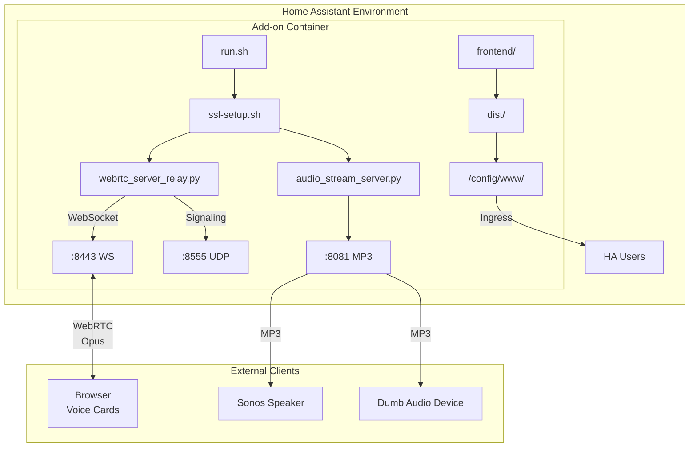

# Architecture

## Overview

This is a **dual-server WebRTC gateway** designed for Home Assistant. It bridges the gap between browser-based voice capture and any audio playback device.

## System Diagram



## Core Components

### 1. WebRTC Signaling Server (`webrtc_server_relay.py`)

**Purpose**: Handle WebSocket connections and WebRTC peer connection setup.

**Key Classes**:
- `VoiceStreamingServer` — Main application class
- Uses `aiohttp` for HTTP/WebSocket server
- Uses `aiortc` for WebRTC peer connections

**Message Protocol** (over WebSocket):

| Message | Direction | Purpose |
|---------|-----------|---------|
| `start_sending` | Client → Server | Client wants to send audio |
| `start_receiving` | Client → Server | Client wants to receive audio |
| `webrtc_offer` | Client → Server | Client sends SDP offer |
| `webrtc_answer` | Server → Client | Server sends SDP answer |
| `ice_candidate` | Bidirectional | ICE candidate exchange |
| `get_available_streams` | Client → Server | List active streams |
| `stop_stream` | Client → Server | Stop sending/receiving |

**Routes**:
- `GET /health` — Health check
- `GET /metrics` — Prometheus-compatible metrics
- `GET /ws` — WebSocket endpoint

### 2. Audio Stream Server (`audio_stream_server.py`)

**Purpose**: Provide MP3 fallback streams for non-WebRTC clients.

**Technical Details**:
- Uses `PyAV` for MP3 encoding
- Re-muxes WebRTC audio track to MP3
- Serves on configurable port (default 8081)

**Routes**:
- `GET /stream/latest.mp3` — Most recent stream
- `GET /stream/{stream_id}.mp3` — Specific stream
- `GET /stream/status` — Active streams list

### 3. SSL Setup (`ssl-setup.sh`)

**Purpose**: Autonomous SSL certificate detection.

**Priority Order**:
1. Home Assistant certificates (`/ssl/fullchain.pem`)
2. Self-signed CA generation (fallback)
3. Ingress mode (HA handles SSL)

### 4. Frontend (`frontend/`)

**Stack**: Lit web components + TypeScript

**Components**:
- `voice-sending-card` — Microphone capture
- `voice-receiving-card` — Speaker output
- `voice-streaming-card-dashboard` — Combined dashboard

**Build**: Rollup bundler → single JS file

## Data Flow

### Sending Audio (Microphone → Server)

```mermaid
sequence Browser->>Server: start_sending
Server->>Browser: sender_ready
Browser->>Server: webrtc_offer (SDP)
Server->>Browser: webrtc_answer (SDP)
Browser->>Server: ice_candidate (UDP media)
Note over Browser,Server: Direct peer-to-peer audio (Opus)
Server->>All Clients: broadcast stream_available
```

### Receiving Audio (Server → Speaker)

```mermaid
sequence Client->>Server: start_receiving
Server->>Server: relay.subscribe(source_track)
Server->>Client: webrtc_offer (SDP)
Client->>Server: webrtc_answer (SDP)
Note over Server,Client: Direct peer-to-peer audio (Opus)
```

### MP3 Fallback Path

```
WebRTC Track → MediaRelay.subscribe() → PyAV Encoder → HTTP Chunked Response
```

## State Management

### Active Streams Dictionary

```python
self.active_streams: Dict[str, Dict] = {
    "stream_<connection_id>": {
        "track": AudioTrack,
        "receivers": [connection_id, ...],
        "sender_id": connection_id,
    }
}
```

### Connection Tracking

```python
self.connections: Dict[str, dict] = {
    "<uuid>": {
        "ws": WebSocket,
        "pc": RTCPeerConnection | None,
        "role": "sender" | "receiver" | None,
        "stream_id": str | None,
    }
}
```

## Networking

- **Host mode required**: Enables direct peer-to-peer UDP
- **Port allocation**: Smart port hunting if default ports occupied
- **Firewall**: Must allow UDP 8555 for WebRTC media

## Dependencies

| Package | Purpose |
|---------|---------|
| aiohttp | Async HTTP/WebSocket server |
| aiortc | WebRTC peer connection implementation |
| PyAV (av) | Audio encoding (MP3) |
| cryptography | SSL certificate handling |
| numpy | Audio buffer processing |
