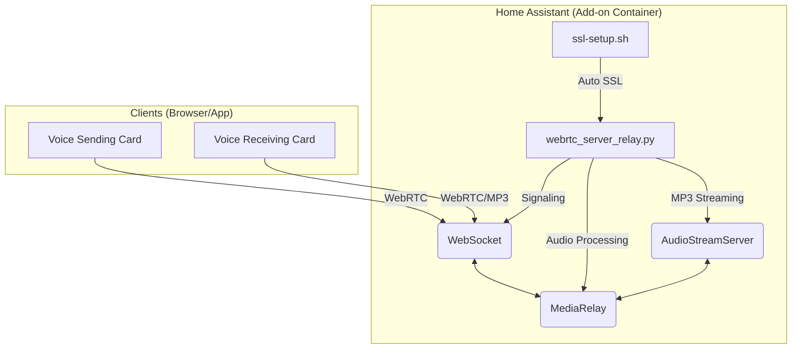

# WebRTC Voice Streaming Add-on

A high-performance Home Assistant Add-on that provides **WebRTC-based real-time voice streaming** with minimal latency. It provides a unified backend for both sending (microphone) and receiving (speaker/announcement) audio.

## Features

- **Unified Signaling**: Single server handles WebRTC signaling, WebSocket events, and MP3 streaming.
- **Autonomous SSL Cascade**: Zero-configuration SSL. It automatically detects Home Assistant certificates, Ingress wrapping, or generates a local CA as a fallback.
- **Host Networking**: Uses host network mode for high-reliability peer-to-peer data flow.
- **Smart Port Hunting**: Automatically finds an available port if the default 8443 or 8080 is taken.
- **Live Visualization**: Provides real-time audio visualization data for frontend cards.

## Architecture

## Installation

### 1. Add Repository & Install

1.  Navigate to **Settings** > **Add-ons** > **Add-on Store**.
2.  Click the **dots** (top-right) > **Repositories**.
3.  Add `https://github.com/Ahmed9190/webrtc-voice-streaming`.
4.  Find **"Voice Streaming Backend"** and click **Install**.
5.  Start the Add-on.

### 2. HTTPS Configuration

WebRTC **requires** a secure context (HTTPS) for microphone access.

- **Option A (Automatic)**: If you already use DuckDNS, Nabu Casa, or custom SSL in Home Assistant, the add-on will automatically use those certificates.
- **Option B (Ingress)**: If you use Home Assistant Ingress, the backend works automatically over HA's secure channel.
- **Option C (Local LAN)**: If you access via IP, the add-on generates a local CA. Visit the add-on's web UI (port 8080 by default) to download and install the CA on your device.

## Usage

### Dashboard Integration

1.  Edit your Dashboard.
2.  Search for **Voice Sending Card** or **Voice Receiving Card**.
3.  Add them to your view. The cards will automatically discover the backend's dynamic port via `/config/www/voice_streaming_backend/server_state.json`.

### Direct Audio Access

You can listen to the latest stream via a standard MP3 player:
`http://<IP>:8081/stream/latest.mp3`

---

## Technical Details

- **Signaling**: WebRTC Offer/Answer over WebSocket.
- **Media**: Opus/PCM via WebRTC, MP3 via `PyAV` (AudioStreamServer).
- **Network**: Host networking required for robust P2P.

## License

MIT
