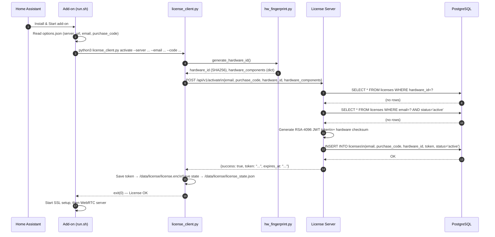
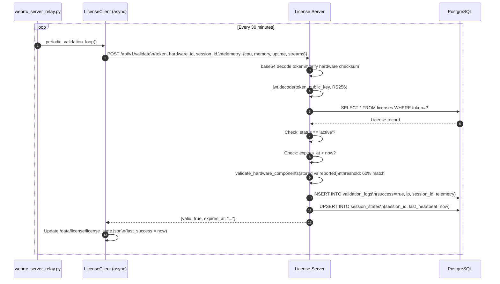
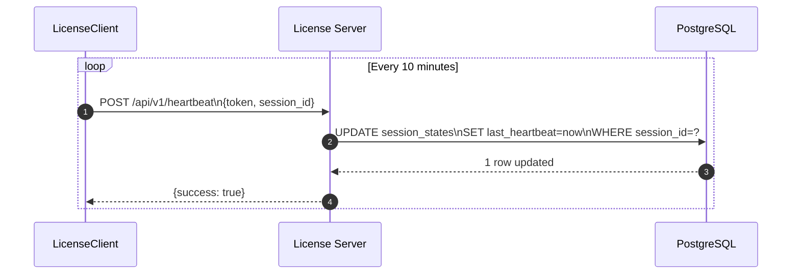
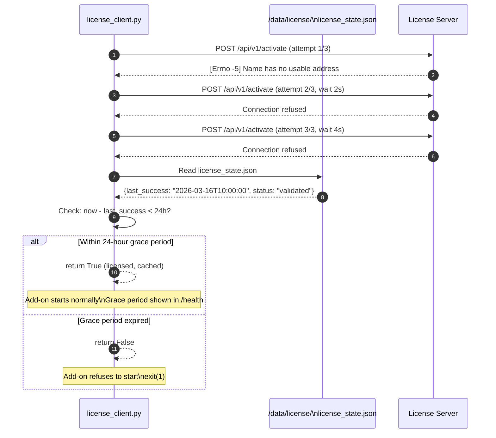
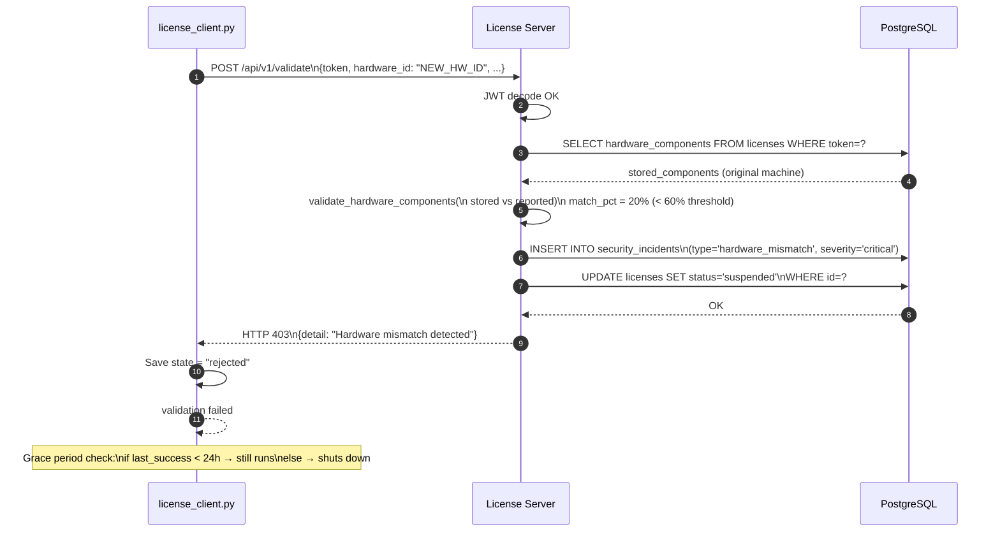
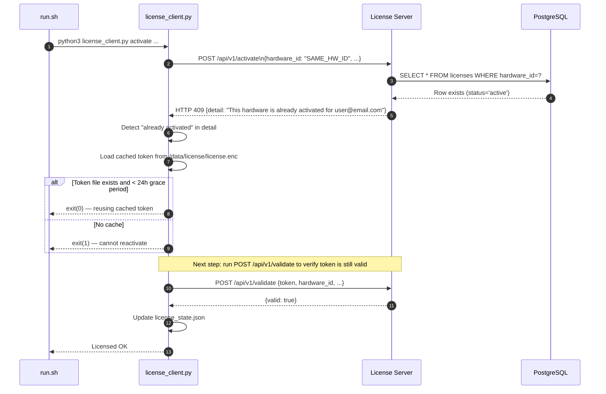
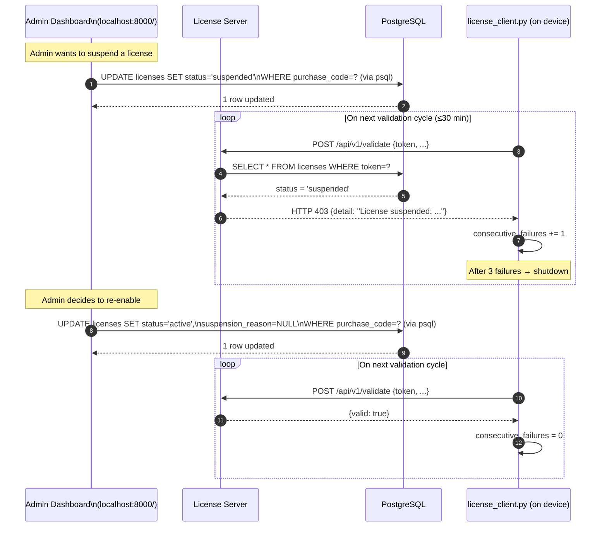
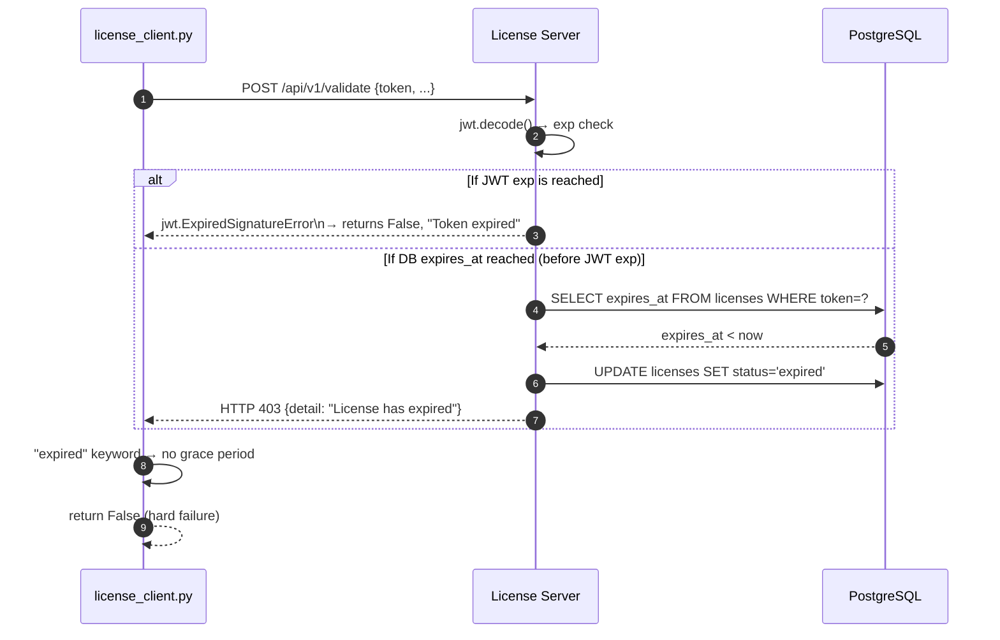
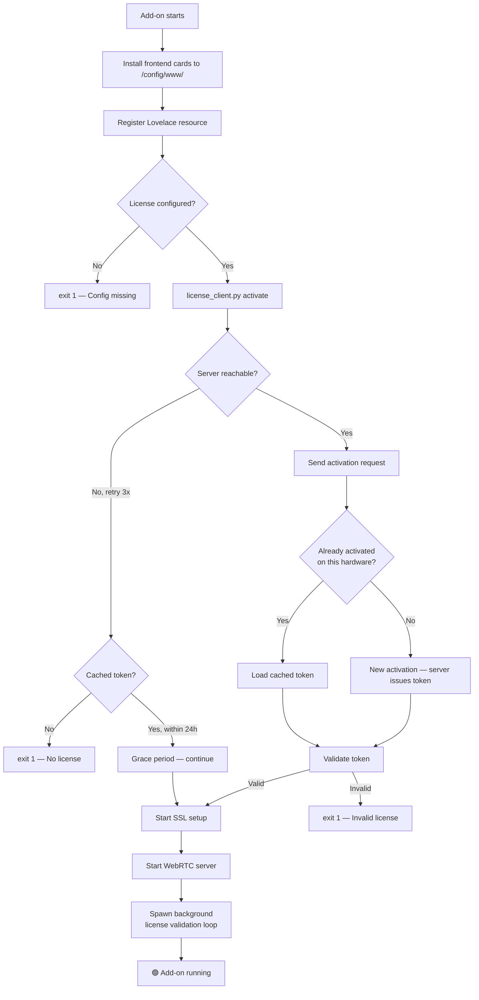

# WebRTC Voice Streaming — Complete License System Guide

> **Audience**: Developer or operator deploying from scratch.
> **Covers**: Architecture, flows, test setup, production setup, admin dashboard, troubleshooting.

---

## Table of Contents

1. [System Architecture](#1-system-architecture)
2. [Component Overview](#2-component-overview)
3. [All Available Flows (Sequence Diagrams)](#3-all-available-flows-sequence-diagrams)
4. [Environment Setup — Test (Local)](#4-environment-setup--test-local)
5. [Environment Setup — Production](#5-environment-setup--production)
6. [Creating & Managing Licenses (Admin Dashboard)](#6-creating--managing-licenses-admin-dashboard)
7. [Add-on Installation & Configuration](#7-add-on-installation--configuration)
8. [End-to-End Test Walkthrough](#8-end-to-end-test-walkthrough)
9. [Security Mechanisms](#9-security-mechanisms)
10. [Troubleshooting Reference](#10-troubleshooting-reference)
11. [API Reference](#11-api-reference)

---

## 1. System Architecture

The system is composed of two completely independent parts that communicate over HTTPS:

```
┌─────────────────────────────────────────────────────────────────────┐
│                     YOUR SERVER (VPS / Cloud)                       │
│                                                                     │
│  ┌──────────────────────────────────────────────────────────────┐   │
│  │                   Docker Compose Stack                        │   │
│  │                                                              │   │
│  │   ┌─────────────┐   ┌─────────────┐   ┌──────────────────┐  │   │
│  │   │    nginx    │   │ license_    │   │   PostgreSQL     │  │   │
│  │   │ (port 80/   │──▶│  server    │──▶│  (port 5432)     │  │   │
│  │   │    443)     │   │ (port 8000) │   │  webrtc_licenses │  │   │
│  │   └─────────────┘   └─────────────┘   └──────────────────┘  │   │
│  │                             │                                 │   │
│  │                             │  /keys (persistent volume)     │   │
│  │                       RSA-4096 key pair                      │   │
│  └──────────────────────────────────────────────────────────────┘   │
└─────────────────────────────────────────────────────────────────────┘
                                 ▲
                      HTTPS API calls
                    (activate / validate / heartbeat)
                                 │
┌─────────────────────────────────────────────────────────────────────┐
│                   HOME ASSISTANT HOST (LAN)                         │
│                                                                     │
│  ┌──────────────────────────────────────────────────────────────┐   │
│  │               HA Add-on Docker Container                      │   │
│  │                                                              │   │
│  │   ┌─────────────┐   ┌──────────────┐   ┌────────────────┐   │   │
│  │   │  run.sh     │──▶│ license_     │──▶│ webrtc_server_ │   │   │
│  │   │ (startup)   │   │ client.py    │   │ relay.py       │   │   │
│  │   └─────────────┘   └──────────────┘   └────────────────┘   │   │
│  │          │                  │                    │            │   │
│  │   hw_fingerprint.py   /data/license/       background        │   │
│  │   (hardware ID)       (cache + token)       heartbeat loop   │   │
│  └──────────────────────────────────────────────────────────────┘   │
└─────────────────────────────────────────────────────────────────────┘
```

### Key Principle

The **license server** only runs in one place (your VPS). Every HA add-on installation must phone home to validate. If the server is unreachable, a 24-hour **grace period** (cached token) allows continued operation.

---

## 2. Component Overview

| Component                           | Location        | Role                                                         |
| ----------------------------------- | --------------- | ------------------------------------------------------------ |
| `license_server/main.py`            | Server          | FastAPI REST API — all endpoints                             |
| `license_server/models.py`          | Server          | SQLAlchemy ORM — 4 database tables                           |
| `license_server/token_generator.py` | Server          | RSA-4096 JWT signing/verification                            |
| `license_server/hw_fingerprint.py`  | Server + Add-on | Hardware ID derivation                                       |
| `license_server/index.html`         | Server          | Admin dashboard (served at `/`)                              |
| `license_client.py`                 | Add-on          | Async client: activate, validate, heartbeat, grace period    |
| `hw_fingerprint.py`                 | Add-on root     | Fingerprint collector (copy of server version)               |
| `run.sh`                            | Add-on          | Startup script — runs license check before any server starts |
| `webrtc_server_relay.py`            | Add-on          | WebRTC relay — spawns background license loop                |

### Database Tables

```
licenses             → One row per activated device (email × hardware_id)
validation_logs      → Full history of validate calls (success + failure + geo)
security_incidents   → HW mismatch, concurrent sessions, auto-suspensions
session_states       → Currently active client sessions (heartbeat updated)
```

### Token Format

```
BASE64 ( RS256-JWT . HMAC-SHA256-checksum[0:24] )
         ↑                  ↑
   signed with RSA      extra hardware binding
   private key           (prevents token sharing)
```

---

## 3. All Available Flows (Sequence Diagrams)

### 3.1 — First-Time Activation Flow

Triggered on **fresh add-on install**, or when `/data/license/license.enc` does not exist.



---

### 3.2 — Periodic Validation Flow

Runs every 30 minutes in the background from `webrtc_server_relay.py`.



---

### 3.3 — Heartbeat Flow

Runs every 10 minutes (lighter than full validation — no DB write to validation_logs).



---

### 3.4 — Grace Period Flow (Server Unreachable)

When the license server is temporarily offline, the add-on continues running using the locally cached token.



---

### 3.5 — Hardware Mismatch / Security Incident Flow

Triggered when a token is used from a device that doesn't match the registered hardware.



---

### 3.6 — Startup With Already-Activated License (Re-start / Re-install)

When the add-on restarts on the same machine that was already activated.



---

### 3.7 — License Suspension & Recovery Flow

Suspend via admin dashboard or auto-suspension by security incident.



---

### 3.8 — License Expiry Flow

When `expires_at` is reached.



---

## 4. Environment Setup — Test (Local)

### Prerequisites

- Docker + Docker Compose installed
- The `webrtc_backend` repository cloned
- A Home Assistant VM (virsh or VirtualBox)
- Your host machine IP visible from the VM (e.g., `192.168.122.1`)

### Step 1: Configure and Start the License Server

```bash
cd /path/to/webrtc_backend

# (Optional) Set a secure secret key
export SECRET_KEY=$(openssl rand -hex 32)

# Start the server stack (PostgreSQL + FastAPI)
docker-compose up -d db license_server

# Verify it's running
curl http://localhost:8000/health
# Expected: {"status":"healthy","database":"healthy"}
```

### Step 2: Open the Admin Dashboard

Open your browser at:

```
http://localhost:8000/
```

The dashboard shows:

- Total / Active / Suspended license counts
- Service health (API, DB, RSA keys)
- Recent licenses and security incidents

### Step 3: Create a Test License Record

You don't pre-create a license. Instead, the **add-on activates itself** on first run. However, for testing you can manually insert a test entry:

```bash
# Method A: Simulate activation via API (recommended)
curl -X POST http://localhost:8000/api/v1/activate \
  -H "Content-Type: application/json" \
  -d '{
    "email": "test@example.com",
    "purchase_code": "MY-TEST-CODE-001",
    "hardware_id": "0000000000000000000000000000000000000000000000000000000000000064",
    "hardware_components": {
      "machine_id": "test-machine-id",
      "mac": "00:11:22:33:44:55",
      "hostname": "test-host"
    }
  }'
```

> **Note**: `hardware_id` must be a 64-character hex string (SHA256).

### Step 4: Install the Add-on on HA VM

1. In Home Assistant, go to **Settings → Add-ons → Add-on Store**
2. Click the **⋮ menu** → **Repositories** → Add:
   ```
   https://github.com/Ahmed9190/webrtc-voice-streaming
   ```
3. Find **Voice Streaming Backend** and click **Install**

### Step 5: Configure the Add-on

In the **Configuration** tab of the add-on:

```yaml
license_server_url: "http://192.168.122.1:8000" # Your host IP, NOT localhost
license_email: "test@example.com"
purchase_code: "MY-TEST-CODE-001"
log_level: debug
audio_port: 8081
```

> ⚠️ Never use `localhost` here — the add-on runs inside Docker and cannot reach your host machine via `localhost`.

### Step 6: Start the Add-on

Click **Start**. Check the **Logs** tab. You should see:

```
════════════════════════════════════════
  WebRTC Camera Add-on Starting
════════════════════════════════════════
[INFO] Validating license...
INFO - Hardware ID: 0a175f30fad805e9...
INFO - License activated successfully.
[INFO] ✅ License validated successfully.
[SERVER] Starting HTTPS on port 8443
```

---

## 5. Environment Setup — Production

### Infrastructure Requirements

| Component          | Minimum Spec                                                              |
| ------------------ | ------------------------------------------------------------------------- |
| VPS / Cloud server | 1 vCPU, 1 GB RAM, 10 GB disk                                              |
| OS                 | Ubuntu 22.04 LTS                                                          |
| Open ports         | 80 (HTTP redirect), 443 (HTTPS), 8000 (direct API, optionally firewalled) |
| Domain name        | Required for TLS (e.g., `license.yourdomain.com`)                         |

### Step 1: Server Preparation

```bash
# On your VPS
sudo apt update && sudo apt install -y docker.io docker-compose git

# Clone your repo
git clone https://github.com/Ahmed9190/webrtc-voice-streaming.git
cd webrtc-voice-streaming
```

### Step 2: Configure TLS (Nginx)

Update `nginx/conf.d/license-server.conf` to use real Let's Encrypt certificates:

```nginx
server {
    listen 443 ssl;
    server_name license.yourdomain.com;

    ssl_certificate     /etc/nginx/ssl/fullchain.pem;
    ssl_certificate_key /etc/nginx/ssl/privkey.pem;

    location / {
        proxy_pass http://license_server:8000;
        proxy_set_header Host $host;
        proxy_set_header X-Real-IP $remote_addr;
        proxy_set_header X-Forwarded-For $proxy_add_x_forwarded_for;
    }
}
server {
    listen 80;
    server_name license.yourdomain.com;
    return 301 https://$host$request_uri;
}
```

Obtain certificates:

```bash
sudo apt install certbot
sudo certbot certonly --standalone -d license.yourdomain.com
sudo cp /etc/letsencrypt/live/license.yourdomain.com/fullchain.pem nginx/ssl/cert.pem
sudo cp /etc/letsencrypt/live/license.yourdomain.com/privkey.pem nginx/ssl/key.pem
```

### Step 3: Set Production Environment Variables

```bash
# Create a .env file (DO NOT commit this to git)
cat > .env << EOF
SECRET_KEY=$(openssl rand -hex 32)
ALLOWED_ORIGINS=https://license.yourdomain.com,http://localhost
EOF
```

### Step 4: Start the Full Stack

```bash
docker-compose up -d
```

Verify all services are healthy:

```bash
docker-compose ps
curl https://license.yourdomain.com/health
```

### Step 5: Back Up the RSA Keys

> ⚠️ **Critical**: If you lose the RSA private key, all existing tokens become invalid and every customer will need to re-activate.

```bash
# Export keys from the Docker volume
docker run --rm -v webrtc_backend_license_keys:/keys alpine \
  tar czf - /keys > license_keys_backup_$(date +%Y%m%d).tar.gz

# Store this backup in a secure offsite location (e.g., encrypted S3)
```

### Step 6: Configure the Add-on for Production

On customer's Home Assistant:

```yaml
license_server_url: "https://license.yourdomain.com"
license_email: "customer@email.com"
purchase_code: "THEIR-PURCHASE-CODE"
```

---

## 6. Creating & Managing Licenses (Admin Dashboard)

### Access the Dashboard

```
http://localhost:8000/        (test)
https://license.yourdomain.com/   (production)
```

### Dashboard Sections

| Page                   | What You Can Do                                                                      |
| ---------------------- | ------------------------------------------------------------------------------------ |
| **Overview**           | See stats, service health, recent licenses and incidents                             |
| **Licenses**           | Search, filter by status, view hardware ID, see warnings                             |
| **Active Sessions**    | See which devices are currently running (last 30 min)                                |
| **Security Incidents** | HW mismatches, concurrent sessions, auto-suspensions                                 |
| **Validation Logs**    | Full history of every validate call with IP, geo, result                             |
| **Tools**              | License lookup by purchase code, health check, manual token validate, RSA public key |

### Workflow: Activating a New Customer

> Licenses are **not pre-created**. The add-on activates itself on first run. Your job is to give the customer a `purchase_code` and the server URL.

1. Customer receives: `email`, `purchase_code`, `license_server_url`
2. Customer installs the HA add-on and enters these in the config
3. On first start, the add-on calls `/api/v1/activate` automatically
4. You can see the new license appear in the **Licenses** page of the dashboard

### Workflow: Suspending a License

Currently done via the DB directly (future: add a dashboard button):

```bash
docker-compose exec db psql -U license_user -d webrtc_licenses \
  -c "UPDATE licenses SET status='suspended', suspension_reason='Payment failed' WHERE purchase_code='THEIR-CODE';"
```

Within 30 minutes, the add-on will detect the suspension on its next validation cycle and stop working. After 3 failed validations it shuts down.

### Workflow: Reinstating a License

```bash
docker-compose exec db psql -U license_user -d webrtc_licenses \
  -c "UPDATE licenses SET status='active', suspension_reason=NULL WHERE purchase_code='THEIR-CODE';"
```

### Workflow: Revoking a License (Permanent)

```bash
docker-compose exec db psql -U license_user -d webrtc_licenses \
  -c "UPDATE licenses SET status='revoked' WHERE purchase_code='THEIR-CODE';"
```

### Workflow: Resetting a License for a New Device

If a customer gets a new machine:

```bash
# Remove the old record — let them re-activate on the new machine
docker-compose exec db psql -U license_user -d webrtc_licenses \
  -c "DELETE FROM licenses WHERE purchase_code='THEIR-CODE';"
```

---

## 7. Add-on Installation & Configuration

### Configuration Options

| Option               | Required | Description                                                                                |
| -------------------- | -------- | ------------------------------------------------------------------------------------------ |
| `license_server_url` | **Yes**  | Full URL to your license server. Must be reachable from the HA host. Use IP, not hostname. |
| `license_email`      | **Yes**  | The email address tied to the purchase.                                                    |
| `purchase_code`      | **Yes**  | The unique alphanumeric purchase code.                                                     |
| `log_level`          | No       | `trace`, `debug`, `info` (default), `warning`, `error`                                     |
| `audio_port`         | No       | Port for audio streaming (default: `8081`)                                                 |

### Add-on Startup Sequence



### Important Notes

- The add-on **will not start** without a valid license or unexpired cached token.
- The cached token lives in `/data/license/` inside the add-on's persistent storage (survives restarts).
- If the add-on container is fully removed and re-created (fresh install), the cache is gone — re-activation is required.

---

## 8. End-to-End Test Walkthrough

This walks through every scenario manually.

### A. Fresh Activation Test

```bash
# On your host machine (where license server runs)
docker-compose up -d

# Verify server health
curl http://localhost:8000/health
```

In HA:

1. Install add-on from custom repository
2. Set `license_server_url: "http://HOST_IP:8000"`, `license_email`, `purchase_code`
3. Click Start
4. **Expected logs:**

   ```
   [INFO] Validating license...
   INFO - Hardware ID: xxxx...
   INFO - License activated successfully.
   [INFO] ✅ License validated successfully.
   ```

5. **Verify in DB:**

```bash
docker-compose exec db psql -U license_user -d webrtc_licenses \
  -c "SELECT user_email, status, hardware_id FROM licenses;"
# Should show 1 row with status='active'
```

---

### B. Re-start Test (Cached Token)

1. Stop and restart the add-on
2. **Expected logs:** Same as above — activation call returns 409 "already activated", add-on loads cached token, validates it, and proceeds.

---

### C. Grace Period Test (Server Down)

```bash
# Stop the license server
docker-compose stop license_server
```

1. Restart the add-on
2. **Expected logs:**
   ```
   WARNING - Request to /api/v1/activate failed (attempt 1/3): ...
   WARNING - Request to /api/v1/activate failed (attempt 2/3): ...
   WARNING - Request to /api/v1/activate failed (attempt 3/3): ...
   INFO - Using cached license token (grace period).
   [INFO] ✅ License validated successfully.
   ```

```bash
# Restore
docker-compose up -d license_server
```

---

### D. Suspension Test

```bash
docker-compose exec db psql -U license_user -d webrtc_licenses \
  -c "UPDATE licenses SET status='suspended', suspension_reason='Test suspension' WHERE user_email='test@example.com';"
```

- Within 30 minutes, the background loop will detect the suspension.
- After 3 consecutive failures, the relay server shuts down.
- **Check the /metrics or /health endpoints** on the add-on for the license status.

To **reinstate**:

```bash
docker-compose exec db psql -U license_user -d webrtc_licenses \
  -c "UPDATE licenses SET status='active', suspension_reason=NULL WHERE user_email='test@example.com';"
```

---

### E. Expiry Test

```bash
# Force-expire a license
docker-compose exec db psql -U license_user -d webrtc_licenses \
  -c "UPDATE licenses SET expires_at=NOW() - INTERVAL '1 second' WHERE user_email='test@example.com';"
```

- On next validation, the server returns 403 "License has expired".
- Unlike suspension, expiry doesn't use grace period — it's a **hard failure**.

To **reset**:

```bash
docker-compose exec db psql -U license_user -d webrtc_licenses \
  -c "UPDATE licenses SET expires_at=NOW() + INTERVAL '365 days', status='active' WHERE user_email='test@example.com';"
```

---

### F. Concurrent Session Test (Security)

In `test_addon_simulation.sh` you can start the same session from two instances:

```bash
# Simulate duplicate session (e.g., copy token to /tmp and run again with same session_id)
./test_addon_simulation.sh
```

- Server creates a `security_incident` of type `concurrent_sessions`
- `warning_count` on the license increments
- After 3 warnings → auto-suspended

---

### G. Hardware Mismatch Test

```bash
# Validate with a wrong hardware ID
curl -X POST http://localhost:8000/api/v1/validate \
  -H "Content-Type: application/json" \
  -d '{
    "token": "<paste_token_here>",
    "hardware_id": "aaaaaaaaaaaaaaaaaaaaaaaaaaaaaaaaaaaaaaaaaaaaaaaaaaaaaaaaaaaaaaaa",
    "session_id": "test-session-mismatch",
    "telemetry": {
      "hardware_components": {
        "machine_id": "wrong-machine",
        "mac": "ff:ff:ff:ff:ff:ff",
        "hostname": "wrong-host"
      }
    }
  }'
# Expected: HTTP 403 {"detail":"Hardware mismatch detected"}
# Check DB: security_incidents should have a new critical row
# Check DB: licenses.status should now be 'suspended'
```

---

## 9. Security Mechanisms

### Hardware Binding (Two Layers)

```
Layer 1 — JWT Claim:
  Token payload contains "hwid": "<hardware_id>"
  Verified by RSA signature (tamper-proof)

Layer 2 — HMAC Checksum:
  Appended after the JWT: token.sha256(token|hardware_id|salt)[0:24]
  Prevents token from working even if you forge a hardware claim
```

### Hardware Component Matching (Soft Validation)

On every `/validate`, the server compares the `hardware_components` dict sent by the add-on against the components stored at activation time.

```
Match score = (number of identical key:value pairs) / (total stored keys)
Threshold  = 60%

Examples:
  All 5 components match → 100% → PASS
  3/5 components match   →  60% → PASS (boundary)
  2/5 components match   →  40% → FAIL → security_incident (critical) → suspended
```

This tolerates minor hardware changes (e.g., NIC replacement) while preventing wholesale device cloning.

### Concurrent Session Detection

```
Session ID  = addon-sha256(hardware_id:hourly_bucket)[0:16]
              (deterministic per machine per hour)

If another session_id is seen alive (heartbeat within 30 min):
  → security_incident (high severity)
  → warning_count += 1
  → If warning_count >= 3 → license suspended
```

### Grace Period Anti-abuse

The 24-hour grace period requires:

1. A `license_state.json` file created by a successful validation
2. `last_success` timestamp within 24 hours

If someone copies the cache files to another machine, the hardware fingerprint check on the next validate call will fail immediately.

---

## 10. Troubleshooting Reference

| Symptom                                           | Likely Cause                                                                     | Fix                                                                                              |
| ------------------------------------------------- | -------------------------------------------------------------------------------- | ------------------------------------------------------------------------------------------------ |
| `[Errno -5] Name has no usable address`           | `license_server_url` uses hostname that doesn't resolve from inside HA container | Use raw IP address (e.g., `http://192.168.122.1:8000`)                                           |
| `ImportError: cannot import name 'LicenseClient'` | `license_client.py` is 0 bytes (corrupted)                                       | Re-install the add-on or run `git pull`                                                          |
| `base name ($BUILD_FROM) should not be blank`     | Docker Dockerfile ARG ordering bug                                               | Ensure `ARG BUILD_FROM` is declared before the first `FROM`                                      |
| `License has expired`                             | DB `expires_at` in the past                                                      | Reset via SQL: `UPDATE licenses SET expires_at=NOW()+INTERVAL '365 days'`                        |
| `Hardware mismatch detected`                      | Add-on running on different machine or hardware changed significantly            | Delete DB record → re-activate on new machine                                                    |
| `License suspended`                               | Auto-suspended by security incident or manual action                             | `UPDATE licenses SET status='active', suspension_reason=NULL WHERE ...`                          |
| Dashboard shows all endpoints as `Not Found`      | Admin endpoints not deployed (old image)                                         | `docker-compose build license_server && docker-compose up -d license_server`                     |
| `Mixed content` error in browser                  | HTTPS page calling WS (not WSS)                                                  | The add-on auto-detects page protocol. Ensure `license_server_url` uses `https://` in production |
| `SUPERVISOR_TOKEN not found`                      | Lovelace resource registration skipped                                           | Non-critical warning. Cards still install but require manual Lovelace resource registration      |

---

## 11. API Reference

### Public Endpoints

| Method | Path                             | Description                           |
| ------ | -------------------------------- | ------------------------------------- |
| `GET`  | `/health`                        | Server health check (API + DB status) |
| `GET`  | `/api/v1/public_key`             | Fetch RSA-4096 public key (PEM)       |
| `GET`  | `/api/v1/status/{purchase_code}` | Get license status by purchase code   |
| `POST` | `/api/v1/activate`               | Activate a new license                |
| `POST` | `/api/v1/validate`               | Validate a license token              |
| `POST` | `/api/v1/heartbeat`              | Send session keep-alive               |
| `GET`  | `/`                              | Admin dashboard (HTML)                |

### Admin Endpoints (No Auth — Protect with Nginx or firewall in production)

| Method | Path                      | Description                          |
| ------ | ------------------------- | ------------------------------------ |
| `GET`  | `/api/v1/admin/licenses`  | All licenses (sorted newest first)   |
| `GET`  | `/api/v1/admin/sessions`  | Active sessions (last 30 min)        |
| `GET`  | `/api/v1/admin/incidents` | Security incidents (most recent 100) |
| `GET`  | `/api/v1/admin/logs`      | Validation logs (most recent 200)    |

### Request / Response Examples

#### POST `/api/v1/activate`

```json
// Request
{
  "email": "user@example.com",
  "purchase_code": "ABC-123-XYZ",
  "hardware_id": "0a175f30fad805e964ab0c4a...",  // 64 hex chars
  "hardware_components": {
    "machine_id": "abc123",
    "mac": "aa:bb:cc:dd:ee:ff",
    "hostname": "homeassistant"
  }
}

// Success Response (201)
{
  "success": true,
  "token": "eyJ0eXAiOiJK...",  // base64-encoded JWT+checksum
  "expires_at": "2027-03-16T17:04:34.789255",
  "message": "License activated successfully"
}

// Already activated (409)
{
  "detail": "This hardware is already activated for user@example.com"
}
```

#### POST `/api/v1/validate`

```json
// Request
{
  "token": "eyJ0eXAiOiJK...",
  "hardware_id": "0a175f30fad805e964ab0c4a...",
  "session_id": "addon-a3f9c12b88e4d901",
  "telemetry": {
    "hardware_components": { "machine_id": "abc123", "mac": "aa:bb:cc:dd:ee:ff" },
    "cpu_usage": 12.5,
    "memory_usage": 45.2,
    "uptime_seconds": 3600,
    "active_streams": 2,
    "addon_version": "1.2.1"
  }
}

// Success Response (200)
{
  "valid": true,
  "expires_at": "2027-03-16T17:04:34.789255",
  "status": "active",
  "warning_count": 0
}

// Failure Responses
// 401 – Invalid token (bad signature, expired JWT)
// 403 – Suspended / revoked / expired / hardware mismatch
// 404 – Token not found in DB
```

#### POST `/api/v1/heartbeat`

```json
// Request
{
  "token": "eyJ0eXAiOiJK...",
  "session_id": "addon-a3f9c12b88e4d901"
}

// Response
{"success": true}
```

#### GET `/api/v1/status/{purchase_code}`

```json
// Response
{
  "email": "user@example.com",
  "status": "active",
  "issued_at": "2026-03-16T17:04:34.789252",
  "expires_at": "2027-03-16T17:04:34.789255",
  "last_validated": "2026-03-16T18:00:00.000000",
  "warning_count": 0,
  "hardware_id_preview": "0a175f30...151ad488"
}
```

---

_Document generated: 2026-03-16 | Version: 1.2.1_
